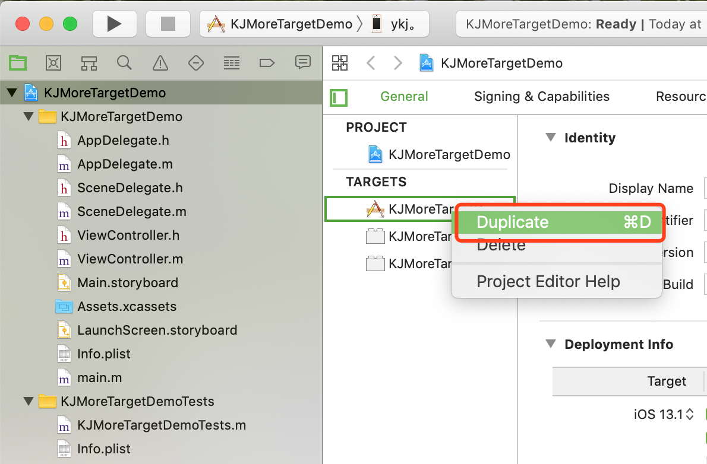
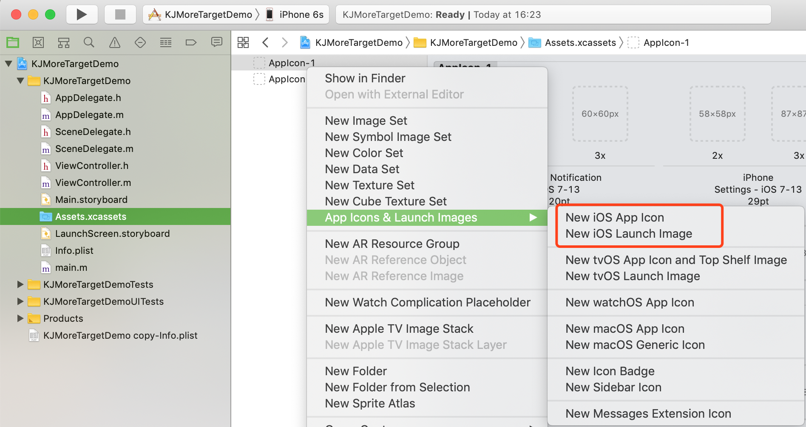
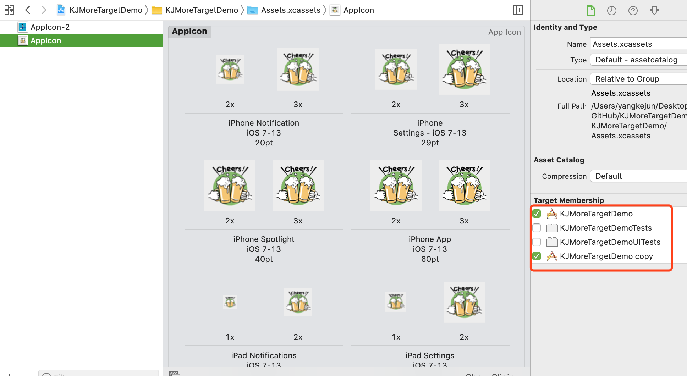
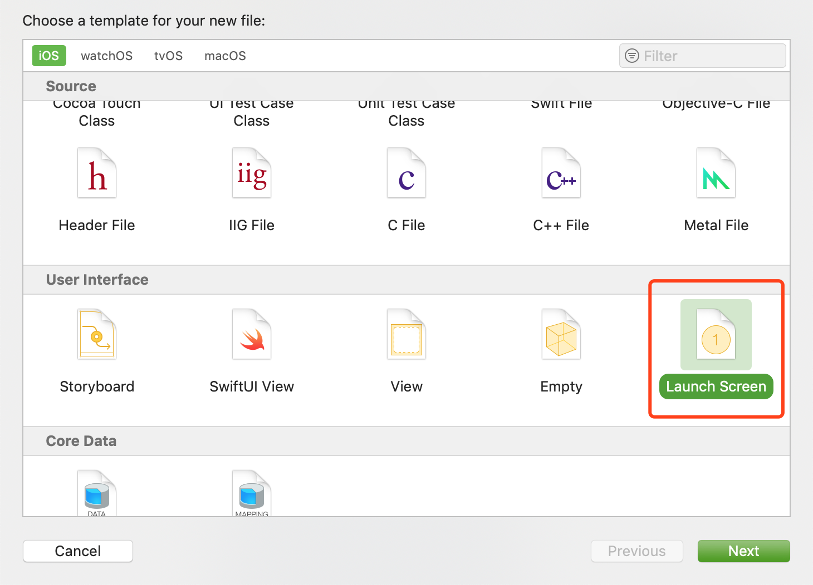
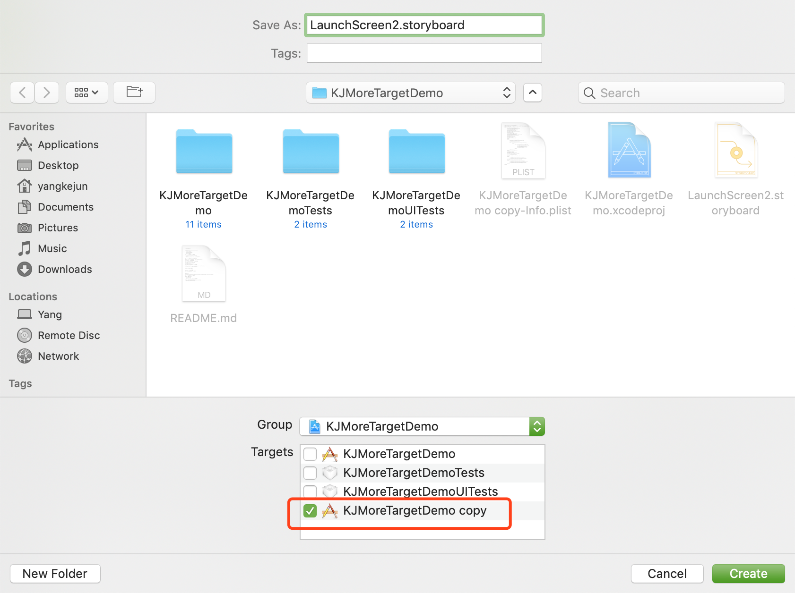
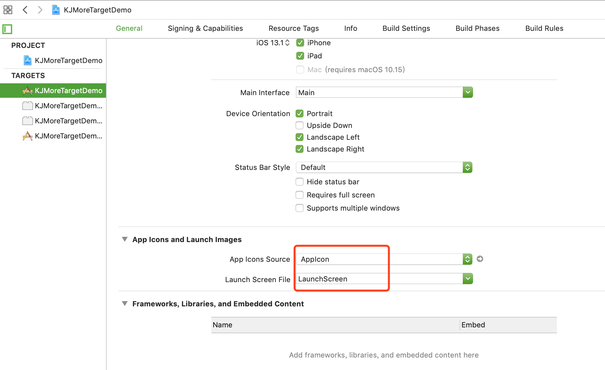
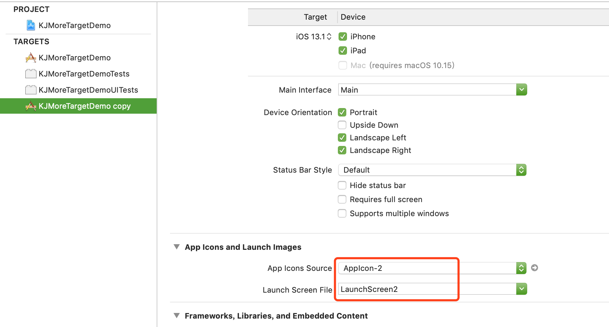
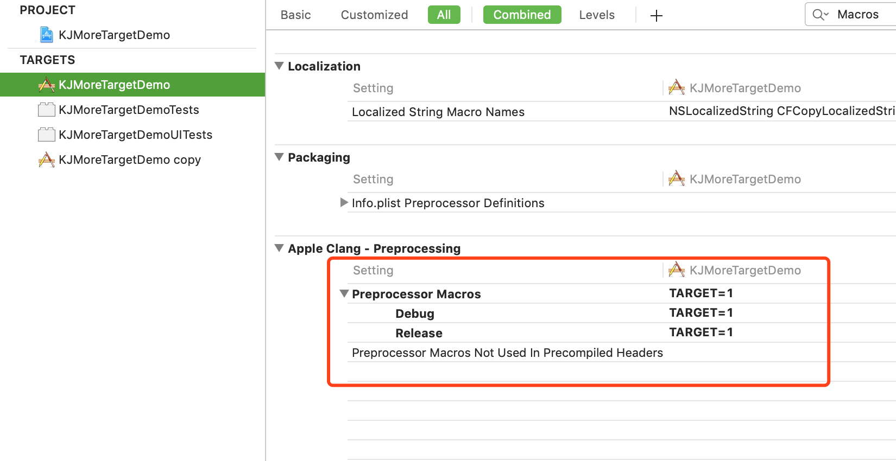
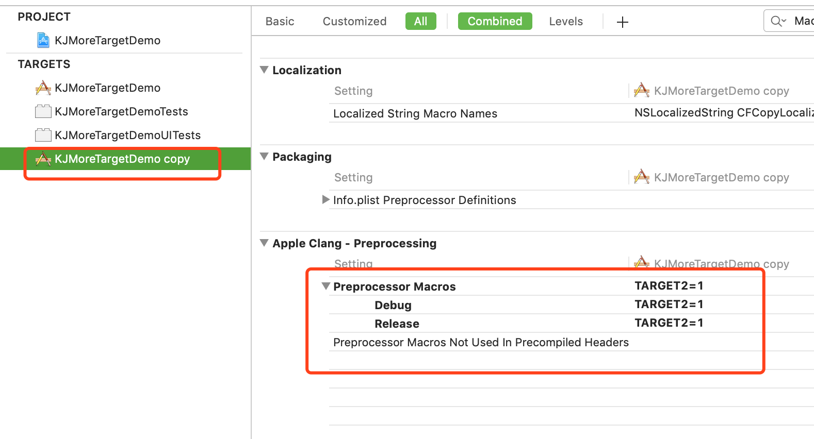
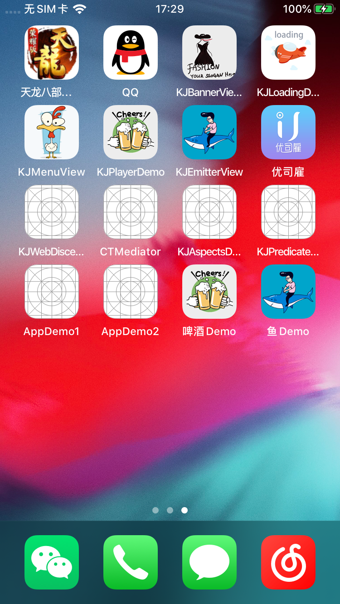

# KJMoreTargetDemo
一个工程多个项目Demo  

----------------------------------------
### 框架整体介绍
* [作者信息](#作者信息)
* [作者其他库](#作者其他库)
* [使用方法](#使用方法)

#### <a id="作者信息"></a>作者信息
> Github地址：https://github.com/yangKJ  
> 简书地址：https://www.jianshu.com/u/c84c00476ab6  
> 博客地址：https://blog.csdn.net/qq_34534179  

#### <a id="作者其他库"></a>作者其他Pod库
```
播放器 - KJPlayer是一款视频播放器，AVPlayer的封装，继承UIView
pod 'KJPlayer'  # 播放器功能区
pod 'KJPlayer/KJPlayerView'  # 自带展示界面

实用又方便的Category和一些自定义控件
pod 'KJEmitterView'
pod 'KJEmitterView/Function'#
pod 'KJEmitterView/Control' # 自定义控件

轮播图 - 支持缩放 多种pagecontrol 支持继承自定义样式 自带网络加载和缓存
pod 'KJBannerView'  # 轮播图，网络图片加载

菜单控件 - 下拉控件 选择控件
pod 'KJMenuView' # 菜单控件

加载Loading - 多种样式供选择
pod 'KJLoadingAnimation' # 加载控件

```

##### Issue
如果您在使用中有好的需求及建议，或者遇到什么bug，欢迎随时issue，我会及时的回复，有空也会不断优化更新这些库

#### <a id="使用方法"></a>使用方法
#####一、创建两个Target  
1、拷贝一份新的Target
<p align="left">
  
</p>
2、修改不同Target对应的不同的 Scheme, info.plist等等数据

#####二、为两个不同的应用添加不同的AppIcon和LaunchScreen.storyboard
1、进入Assets.xcassets 右键创建不同的AppIcon
<p align="left">
  
</p>
1.1 这边需要把两者都勾选上，否则会出现`编译的不同Target的时候会获取不到资源的情况`
<p align="left">
  
</p>
2、创建不同的LaunchScreen.storyboard
<p align="left">
  
</p>
保存在相对应的Target当中
<p align="left">
  
</p>
3、选择相对应的AppIcon和LaunchScreen.storyboard
KJMoreTargetDemo对应的AppIcon和LaunchScreen.storyboard
<p align="left">
  
</p>
KJMoreTargetDemo copy对应的AppIcon-2和LaunchScreen2.storyboard
<p align="left">
  
</p>
4、选择不同的Target运行项目


#####三、代码里面利用宏定义来区分不同的Traget
1、在Bundle Setting里面设置一下Proprecessor Macros添加一份`TARGET`和`TARGET2`的参数来区分到底是那个Traget
KJMoreTargetDemo对应的Proprecessor Macros
<p align="left">
  
</p>
KJMoreTargetDemo copy对应的Proprecessor Macros
<p align="left">
  
</p>
>备注：TARGET 和 TARGET2 后面代码块里面会使用到

2、代码里面用上面的宏去判断代码块  
解决一些需要不同处理方式，则用下面这一组宏

```
#if TARGET
    /// KJMoreTargetDemo当中的代码块实现
    KJTargetViewController *vc = [KJTargetViewController new];
    [self.navigationController pushViewController:vc animated:YES];
#elif TARGET2
    /// KJMoreTargetDemo copy当中的代码块实现
    KJTargetViewController2 *vc = [KJTargetViewController2 new];
    [self.navigationController pushViewController:vc animated:YES];
#endif
```

####四、运行效果
啤酒Demo 和 鱼Demo 就是两个对应的项目
<p align="left">
  
</p>